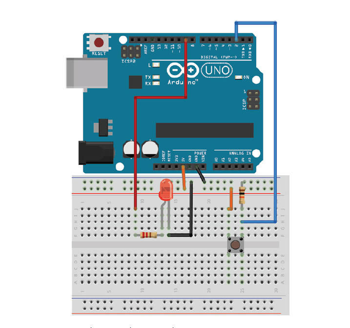
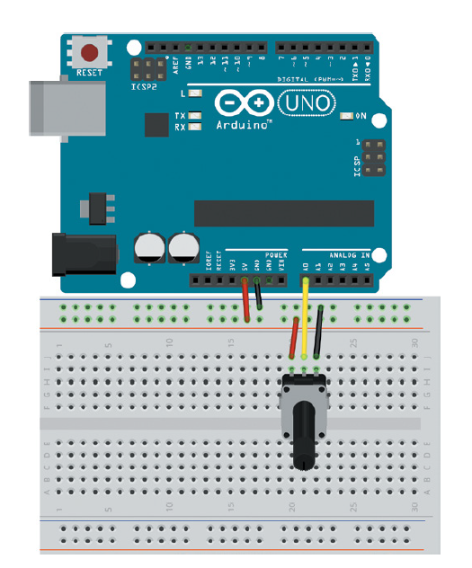
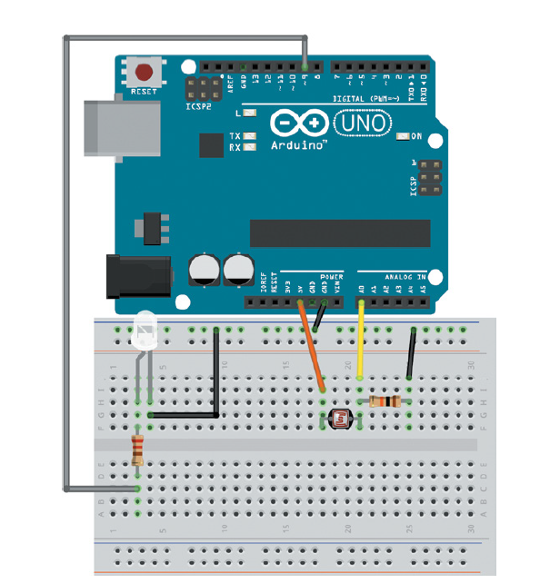

# Simple-Arduino-Projects
- This repository includes the code of simple Arduino projects.
## Projects: 
### 1. BlinkingLED :
- This project aims at blinking a LED using a pushbutton by clicking the button once to turn it on and clicking the button again to turn it off. This code makes use of the debouncing effect of the pushbutton to achieve this functionality.

### 2. Potentiometer :
- This project aims at reading the varying voltage caused by turning the potentiometer and printing its value on the serial monitor.

### 3. PhotoResistor :
- This project aims at controlling the illumination of the LED using the photoresistor. The illumination of the LED increases in dark, while it decreases in light.

